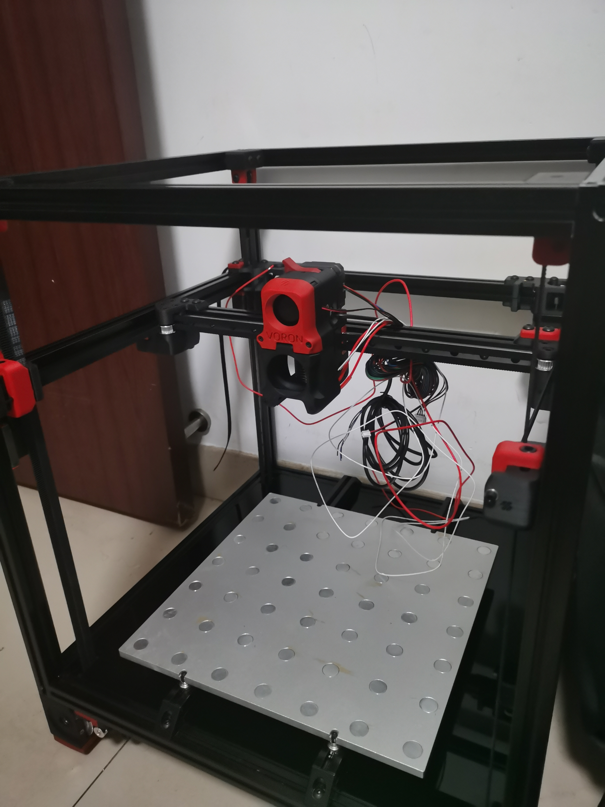

# Voron2.4 3D Printer

**构建中......**

* 别买 **凌创三维** 的东西，能用但巨坑，它们好像没做过打印机，件都有问题，未来肯定要换掉他家的东西  
* **FYSETC** 是参与Voron项目的，能买他家的就买他家的，省心  

 小白别折腾这台机器，折腾你会后悔的，烧钱，费时间，有烧件风险，短期效果不好，先买成品练手，或别碰 

* [Voron2](https://github.com/VoronDesign/Voron-2)
* [蜘蛛主板](https://github.com/FYSETC/FYSETC-SPIDER/blob/main/%E8%AF%B4%E6%98%8E%E6%96%87%E6%A1%A3_%E4%B8%AD%E6%96%87.md)
* [klipper固件](https://www.klipper3d.org/zh/)
* [klipper Web UI fluidd](https://github.com/fluidd-core/fluidd)
